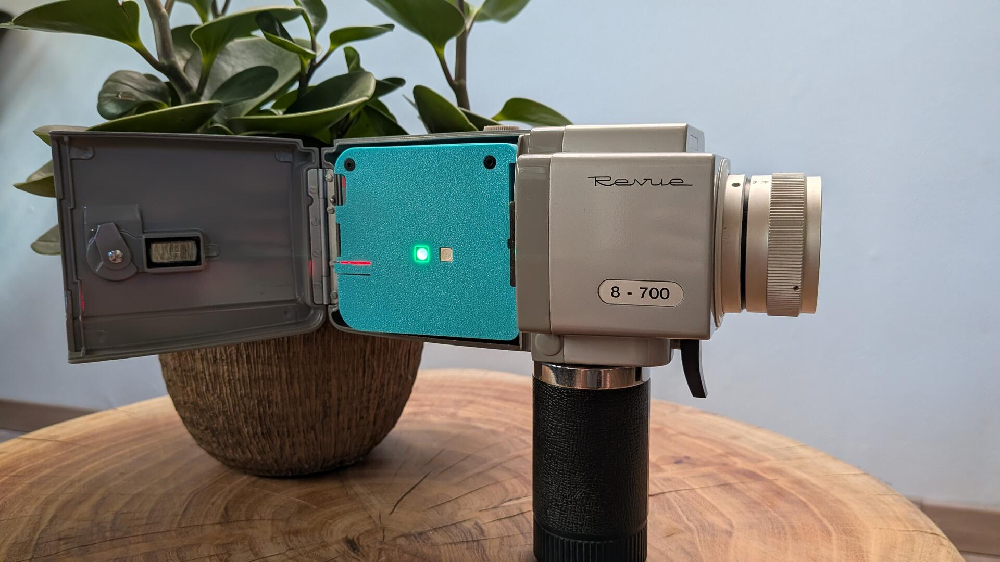
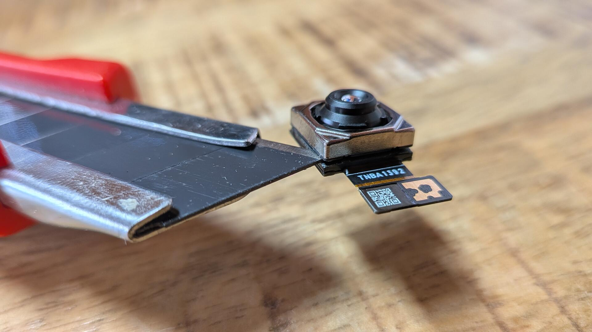
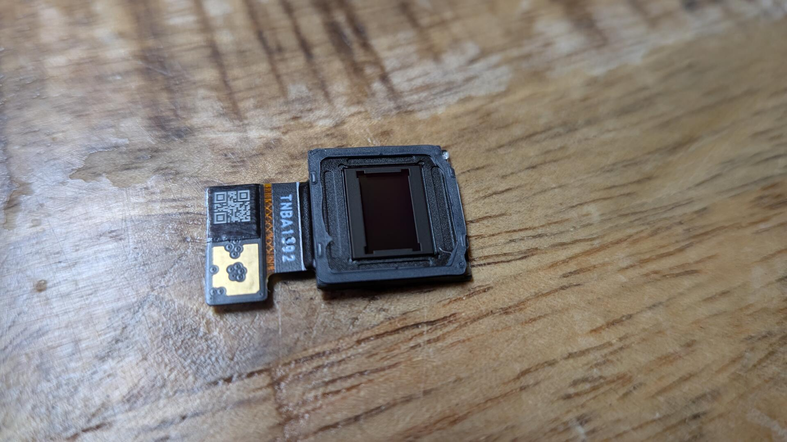
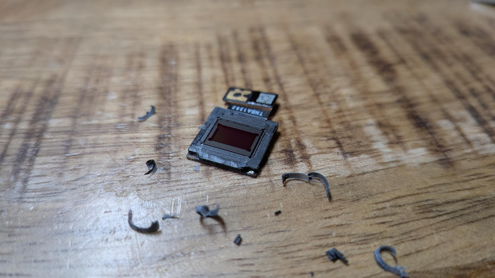
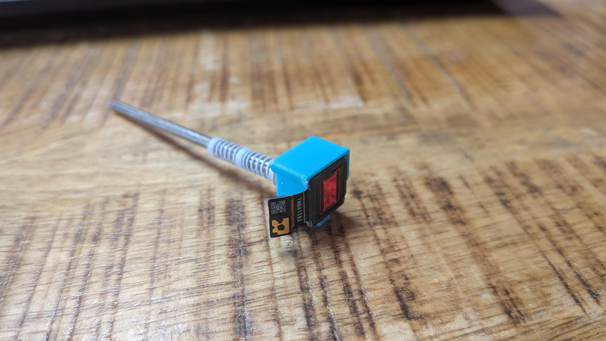
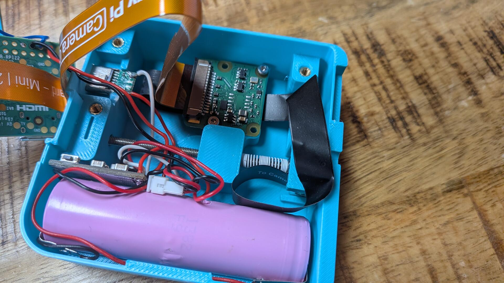
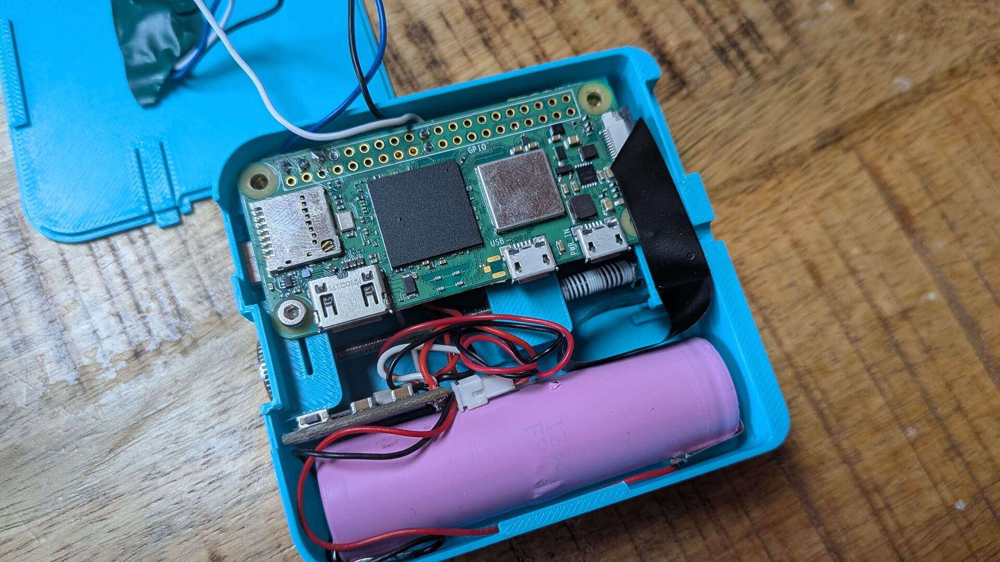

# SuPi-8

*Capture Moments, not Perfection.*

A Raspberry Pi Zero 2W tucked inside a Super 8 cartridge brings any Super 8 camera with a removable film gate back to life. It comes with a Wi-Fi hotspot, a web UI for live preview, and brightness-triggered recording.

> ## ⚠️ Be advised, this is an alpha version.
> ### Still early, still rough around the edges. Some things won't work quite right, some things might just be broken. Have fun with it, test it as much as you can, report bugs, issues and suggestions, but don't expect a fully polished experience yet.



Super 8 film is expensive, and getting it developed these days is even more so. SuPi-8 lets you keep shooting on the camera you already own without buying or processing a single roll. It's not a lens adapter or a hack bolted onto the outside; it replaces the film cartridge itself, with the sensor sitting exactly where the film used to run. The camera's original optics, shutter, and frame-advance mechanism do all the work exactly like they always did, so the picture keeps its authentic Super 8 look and feel.

It works with pretty much any camera that lets you unscrew the film gate, which is almost every Super 8 camera, with the notable exception of Nizo models. Removing the gate is fully reversible: nothing gets modified or damaged, so the camera can always go back to shooting real film. The Raspberry Pi Zero 2W, sensor, battery, and all the electronics live inside a compact 3D-printed cartridge body that takes the place of the film reel.

## Hardware

**Electronics**

- **Raspberry Pi Zero 2W**
- **Camera Module 3** (lens removed)
- **Arducam B0439** 200 mm sensor extension cable
- **2× WS2812b LED modules**
- **18650 Li-ion battery**, with U-shaped solder tabs
- **JST connector + socket**
- **MH-CD42**
- **USB-C socket**
- SD card ≥ 16 GB
- Super 8 Camera with removed Film Gate

**Mechanical / fasteners**

- 1× compression spring, 1 × 6 × 20 mm (DIN 2095)
- 1× M3 threaded rod, 70 mm
- 1× M3 nut
- 2× M3 washer (DIN 125)
- 1× M3 knurled nut, high form (DIN 466)
- 3× M2.5×4 threaded inserts
- 1× M3×4 threaded insert
- 4× M2×3 threaded inserts
- 4× M2×6 screws (DIN 912)
- 1× M2.5×6 screw (DIN 912)
- 2× M2.5×12 screws (DIN 7991)

**Tools / consumables**

- Soldering iron + a bit of wire
- Thin enameled copper wire (magnet wire)
- Sharp thin blade (scalpel or razor blade)
- Insulation tape
- A 3D-Printer and a bit of filament
- Glue

## Assembly guide

<details>
<summary>Click to expand the full assembly guide</summary>

## Preparation

Before assembly, the lens has to be removed from the Camera Module 3 so the bare sensor sits flush where the film gate was.

1. Remove the film gate from your camera. Usually two screws right where the film would move along. Those are sometimes a bit fiddly.
2. Remove the sensor module from the board and scrape the glue off the backside.
3. Gently warm the lens holder (e.g. with a hot air gun on low, or a hairdryer). This softens the adhesive holding the lens assembly to the sensor board.
4. While warm, carefully work a sharp, thin blade (scalpel or razor blade) under the edge of the lens holder and slowly pry it loose. Go slowly and reheat if it resists - the sensor underneath is fragile and easily scratched or cracked. The two autofocus wires will typically break as the lens holder comes free; that's expected.


5. Carefully scrape off the remaining glue from the edges so the front sits flat.

6. Once removed, keep the sensor covered/protected until it's mounted in the cartridge to avoid dust on the die.


## Assembly

### 1. Print the case

Print the cartridge housing - ideally in a filament with some heat resistance (e.g. ABS/ASA/PETG). For the sensor holder, enabling ironing in your slicer is recommended for a smoother surface. The housing needs a bit of support. Sanding or smoothing out the rough edges where the sensor holder needs to slide is recommended.

### 2. Wire the electronics

Easiest done on the bench before anything goes into the case:

1. Solder a JST cable to the battery.
2. Solder a matching JST socket to the MH-CD42, along with wires for VIN (5V in) and OUT + GND (5V out).
3. Solder the VIN wires to the USB-C socket (this is the charging input).
4. Solder the OUT and GND wires to the Pi's 5V/GND header pins (physical pin 4 = 5V, pin 6 = GND) - this powers the Pi directly through the GPIO header instead of its own USB port.
5. Solder wires for the LEDs to 5V (physical pin 2) and GND, plus a data wire to GPIO10 (physical pin 19).
6. Chain the two LED modules together. Thin enameled copper wire (magnet wire) is recommended here.
7. Solder the wires from step 5 onto the first LED module.
8. Glue both LED modules into the lid and cover the solder joints with insulation tape.

### 3. Prepare the housing

Press in the threaded inserts: 4× M2 for the Camera Module 3 board, 3× M2.5 for the Pi, and 1× M3 into the sensor holder.

### 4. Build the sensor/focus assembly

1. Screw the M3 threaded rod into the sensor holder and lock it with an M3 nut and a washer, then slide the spring onto the rod.
2. **Carefully** glue the bare sensor with a **small** drop of glue onto the sensor holder and connect it with the Arducam extension cable.

3. Connect the ribbon cable and the Arducam B0439 extension cable to the Camera Module 3 board.
4. Screw the Camera Module board down with the 4× M2×6 screws, with the Arducam connector facing down.

### 5. Final assembly

1. Put the washer through the slot, slide the sensor holder (with rod and spring) into the housing and lock it in place with the knurled nut.
2. Glue the USB-C socket into position.
3. Glue the MH-CD42 charging board into position.
4. Glue the battery into position.

5. Fold the Raspberry Pi camera cable so it fits inside the housing and connect it to the Pi.
6. Screw the Pi down with the single M2.5 (DIN 912) screw in the center mounting hole.
7. Plug the battery's JST connector into the MH-CD42.

8. Close the lid and screw it shut.


## Quick Start

### Option A: Flash the pre-built image (recommended)

The easiest way to get started - no manual partitioning, no dependency installs.

1. Download the latest `supi-8_*.img.xz` from the [Releases](../../releases) page. It's compressed because GitHub caps individual release files at 2 GiB, and the raw image is bigger than that.
2. Flash it to an SD card (≥ 16 GB) with [Raspberry Pi Imager](https://www.raspberrypi.com/software/), [balenaEtcher](https://etcher.balena.io/), or `dd`. Imager and balenaEtcher can both write the `supi-8_*.img.xz` directly without unpacking it first - or you can unzip it yourself to get the raw `.img`, e.g. if you want to inspect or modify it with other tools before flashing.
3. Insert the card and boot the Pi.

On first boot, SuPi-8 automatically grows and formats the data partition to use all the free space on your card - however big it is - so there's nothing to prepare manually. This takes a few seconds and only happens once; after that it boots straight into the hotspot.

The default login is `pi` / `Classic!` (same convention as the hotspot password). If you connect the Pi to other networks, change it with `passwd` via ssh after your first login.

Then jump to [Connect](#connect) below.

### Option B: Build from source

For developers, or if you want to build your own image from scratch.

#### 1. Flash the SD card

Flash **Raspberry Pi OS Lite (64-bit)** to an SD card (≥ 16 GB). **Before booting the Pi for the first time**, resize the root partition to 8 GB and create an exFAT partition for the remaining space. Use [GParted](https://gparted.org/) or any suitable partition editor:

1. Resize the rootfs partition to **8 GB**
2. Create a new **exFAT** partition in the unallocated space (label it `RECORDINGS`)
3. Apply changes and boot the Pi

#### 2. Boot, clone, install

```bash
sudo apt install git
git clone https://github.com/Schwendilator/SuPi-8.git
cd SuPi-8
sudo bash setup.sh
```

Set a hotspot password (or press Enter for `Classic!`). The installer does everything - partitions the SD card, installs dependencies, deploys the app, creates the hotspot. Reboot when prompted.
You can edit the scripts beforehand if you want to change anything.

</details>

### Connect

The Pi creates a Wi-Fi hotspot:

- **SSID:** `SuPi-8 <last 4 MAC chars>`
- **Password:** the one you chose (or `Classic!` if you flashed the pre-built image)
- **IP:** `10.42.0.1`

Open `http://10.42.0.1/` in a browser. You'll see the live preview, camera status, controls, and recordings.

It also works as a Wi-Fi client. If you connect it to your home network via the Setup page, it will prefer that over the hotspot and automatically fall back to the hotspot if the connection drops.

## Recording

The camera fires at 18 fps by default (adjustable in the web UI). Recording starts automatically when the scene is bright enough; it stops when it gets dark. Raw footage is muxed to `.mp4` in the background. Files land on the exFAT data partition so you can pop the SD card into any computer to grab them.

### Status LEDs: 
the first LED shows recording status - solid green when idle, blinking red while recording. The second LED only lights up while recording or previewing, and shows focus/exposure: solid green means focus and exposure look good, blinking blue means underexposed, blinking white means overexposed, and blinking red on its own means out of focus. Red blinking together with blue or white means both out of focus and over/underexposed.

## Web UI

**Dashboard:** Live preview with optional focus peaking overlay, brightness/gain/temp/focus readouts, controls for FPS, threshold, bitrate, white balance.

**Setup:** Connect to Wi-Fi, upload firmware updates, restore previous versions, factory reset.

Vibe Coded with Claude, because I don't like doing frontends.


## Updating

Upload the `update.tar.gz` via the Setup page.

The device backs up the current version, deploys the new one, and restarts. If the new code crashes, it automatically rolls back. Manual restore is also available from the Setup page.

## Operation

**Power:** press the button once to turn the device on, press it twice to turn it off.

**Setting focus:** enable focus peaking in the web UI, zoom the camera to a distant subject, and slowly turn the knurled nut until the peaking overlay shows the subject in sharp focus. Zoom back to your working focal length and fine-tune if needed. A few things that help:
- Focus on something with clear edges or texture rather than a flat surface - peaking is easier to read on contrast.
- Do this in good light, since peaking relies on brightness/contrast in the live preview.
- Super 8 lenses often shift focus slightly across their zoom range - if you plan to zoom while filming, a mid-range zoom setting is a reasonable compromise when setting focus.
- The knurled nut is what moves the sensor holder closer to or further from the film plane - that's the focus mechanism itself. Once the image is sharp, stop turning; any further turning shifts focus again. Try to avoid bumping it during transport or filming.

**Charging:** always remove the SD card before charging. With the card in, the Pi boots normally as soon as it's connected to power. Since recording starts automatically whenever there's enough light, it can end up recording continuously (and filling up storage) for as long as it's on the charger. There are some safeguards in place already to reduce this risk, but better safe than sorry. Proper USB support that avoids this altogether is planned, but it's quite a bit of work.

**Date and Time:** Before starting to film, connect your phone with the WiFi hotspot. Otherwise the timestamps won't be correct.

## The CAD Files

The `CAD/` directory contains the cartridge design.

## Acknowledgments

This project wouldn't exist without the people and projects that inspired it:

- [Jenny List](https://www.youtube.com/@jennylist)
- [befinitiv](https://www.youtube.com/@kassenbon)
- [digitalsuper8.com](https://www.digitalsuper8.com/)
- [element14 presents](https://www.youtube.com/@element14presents)

## License

**Software** (setup.sh, worker/, templates/, scripts/, services/) - [GNU General Public License v3.0](LICENSE)

**Hardware** (CAD/) - [CERN Open Hardware Licence Version 2 - Strongly Reciprocal](LICENSE_HARDWARE)